# Missing Semester Evaluation
## Missing-Semester-Exercise-2 project from Manuel Hochreiter and Andrea Zoitl

At first we only thought about programming a Bad UI. But of course we also had to come up with a theme, otherwise it's only half as much fun. So why not evaluate the course?

### Are you curious? Start with MissingSemesterEvaluation.html.   We recommend using Google Chrome, as I sometimes had display errors with Firefox 

If you're not a fan of surprises and want to know what to expect, you'll have to scroll down. Otherwise the surprise would be spoiled for the others

-
-
-
-
-
-
-
-
- keep going
-
-
-
-
-
-
-
-
-
- keep going
-
-
-
-
-
-
-
-
-
- keep going
-
-
-
-
-
-
-
-
-
-
### So do you really want to see what happens before you try it out?
This is the starting page:
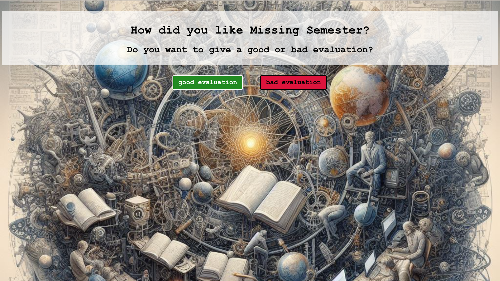
Try to press the button for the **good evaluation**. You will see that it keeps jumping away and therefore cannot be clicked.
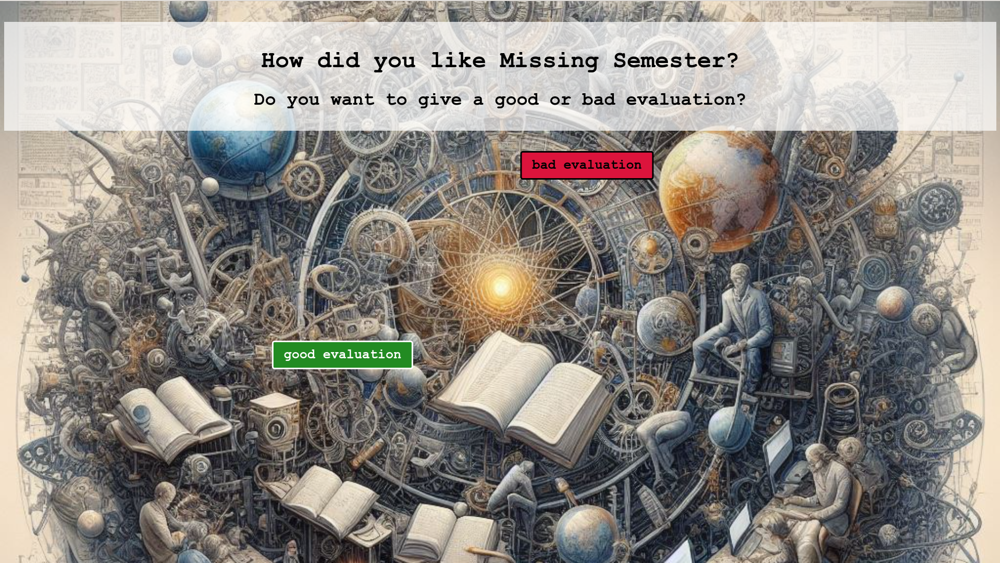
Well, if the good evaluation button doesn't work, then try the **bad evaluation** button.  
But, a bad evaluation has to be earned:  Play the game, only then are you worthy. You will be redirected to itch.io. Press the **Play on itch.io** button.
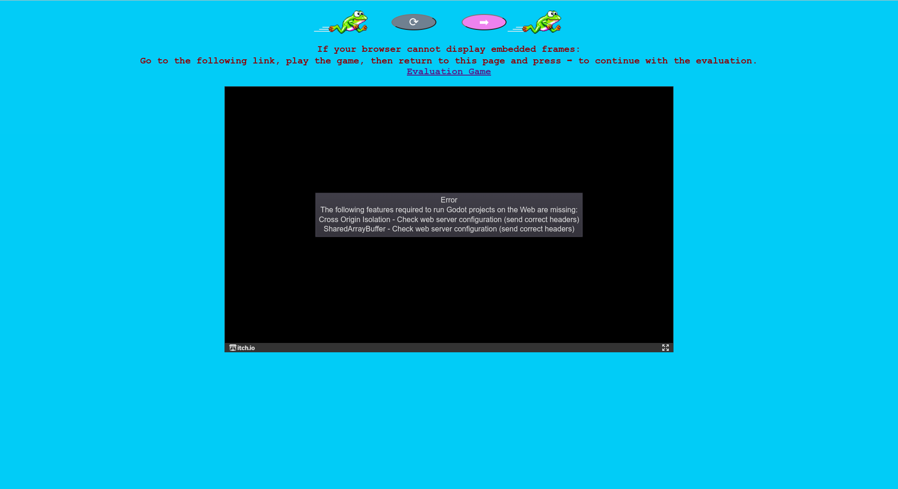
Let's play the game! Press **Run game**.
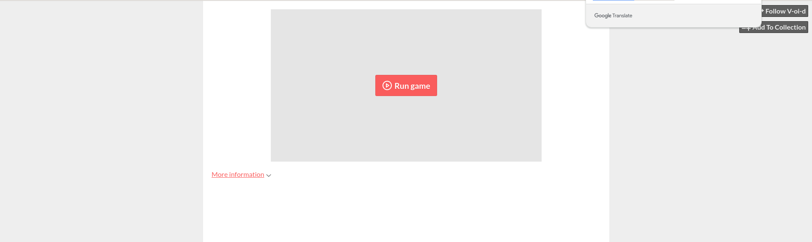
Try to complete the level 1:  
Navigate with the arrow keys as usual. > for right, < for left and ^ for jumping. 
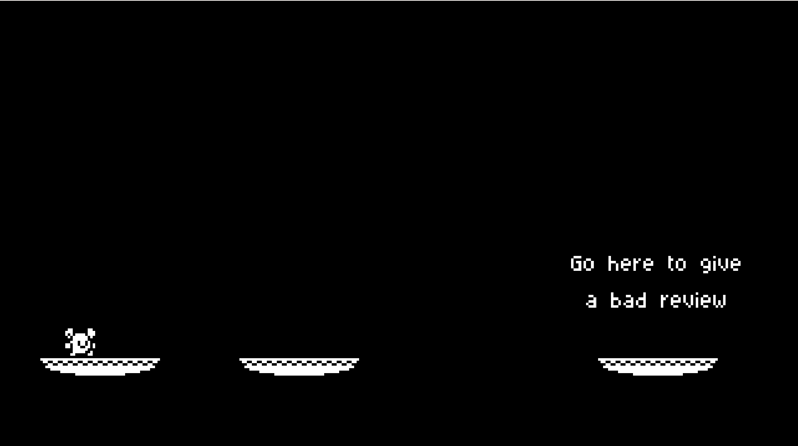
Keep trying to complete the level 1:
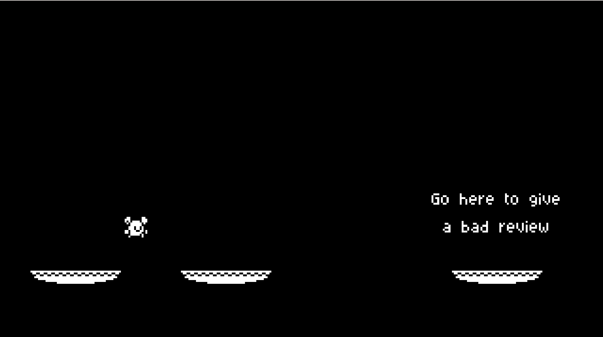
Oh, so you didn't manage level 1, maybe you can manage level 2?
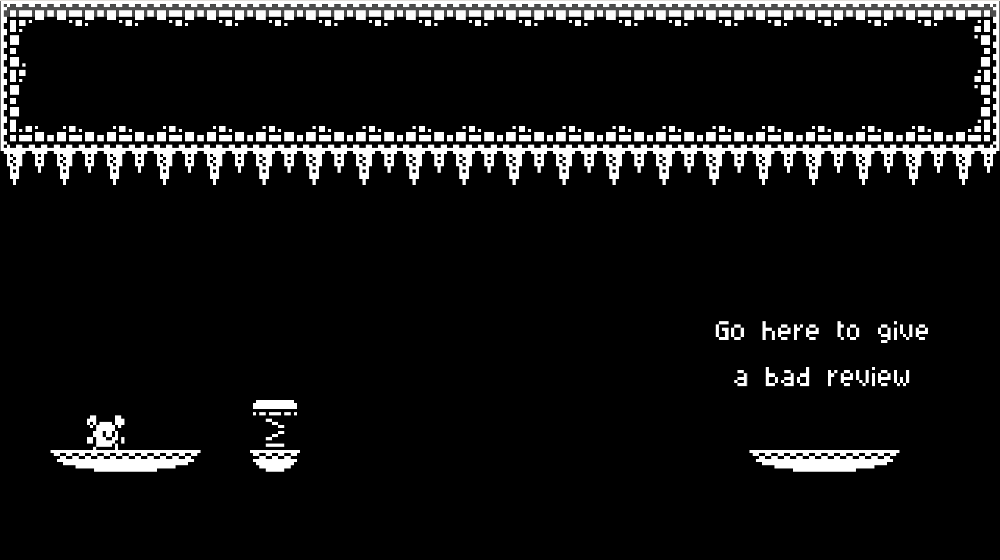
Neither? Maybe level 3? 
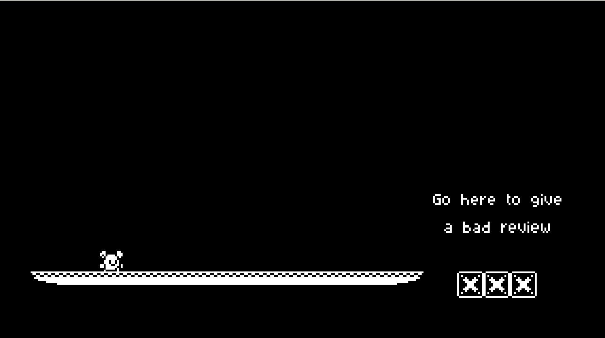
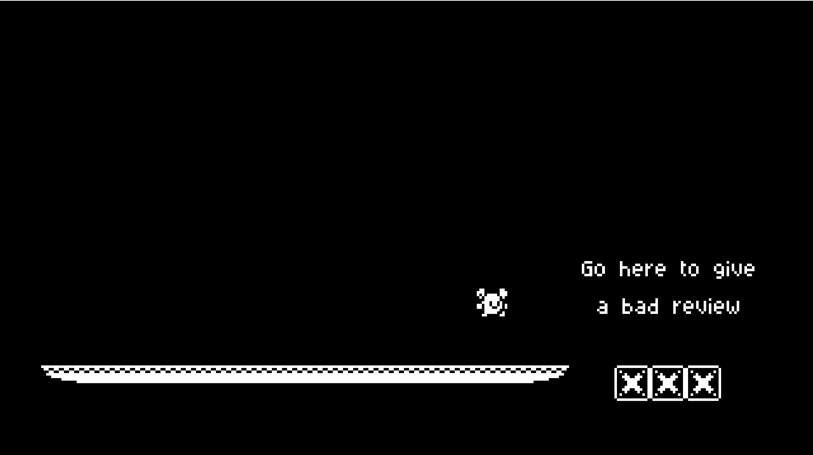
Too bad, but a bad evaluation was a bad idea anyway.
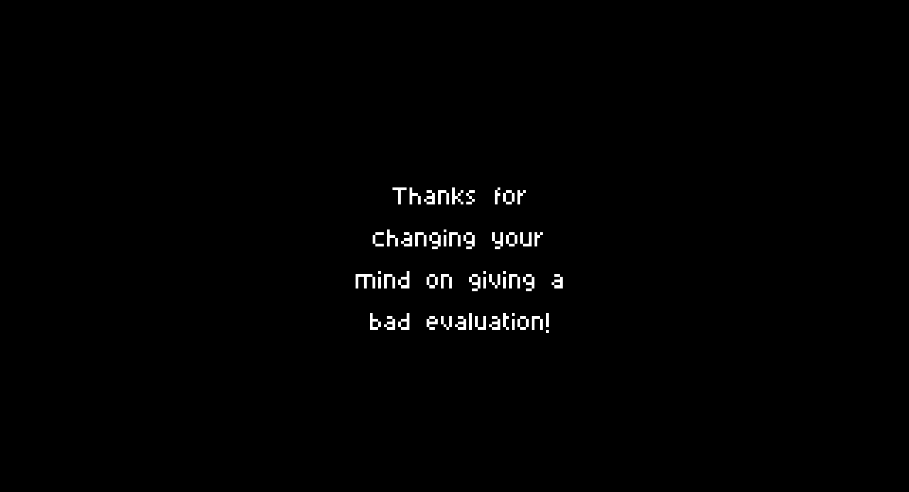
You're not giving up, all right, let's try again:
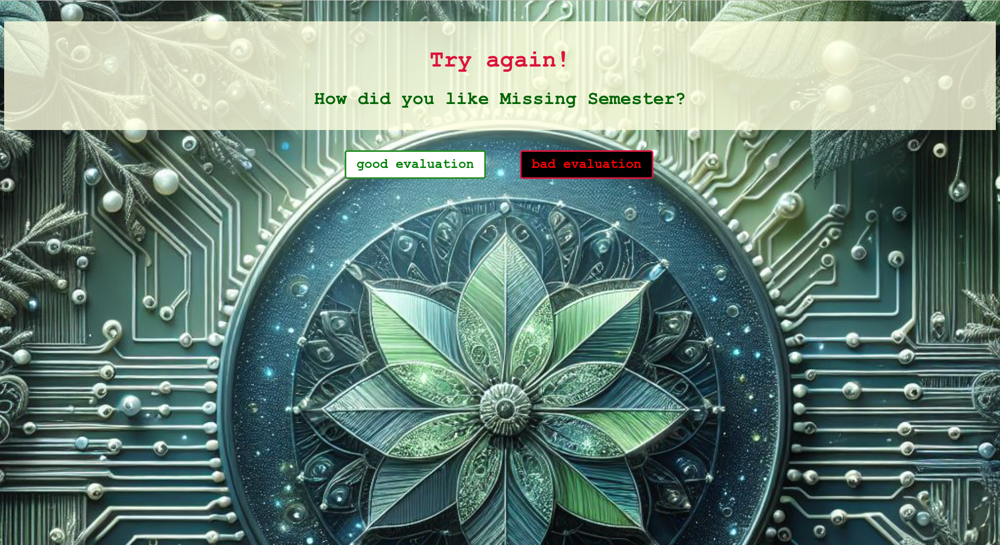
Seriously, a bad evaluation? 
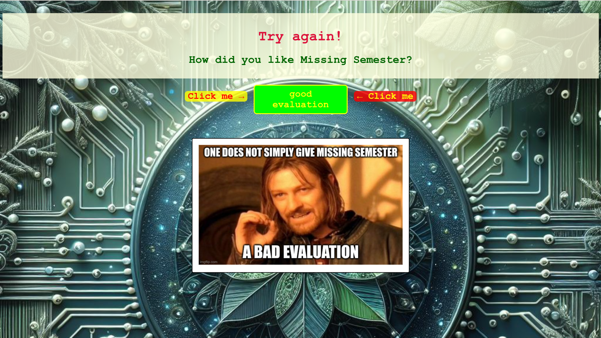
Time to rethink your decision. Did you like Missing Semester?
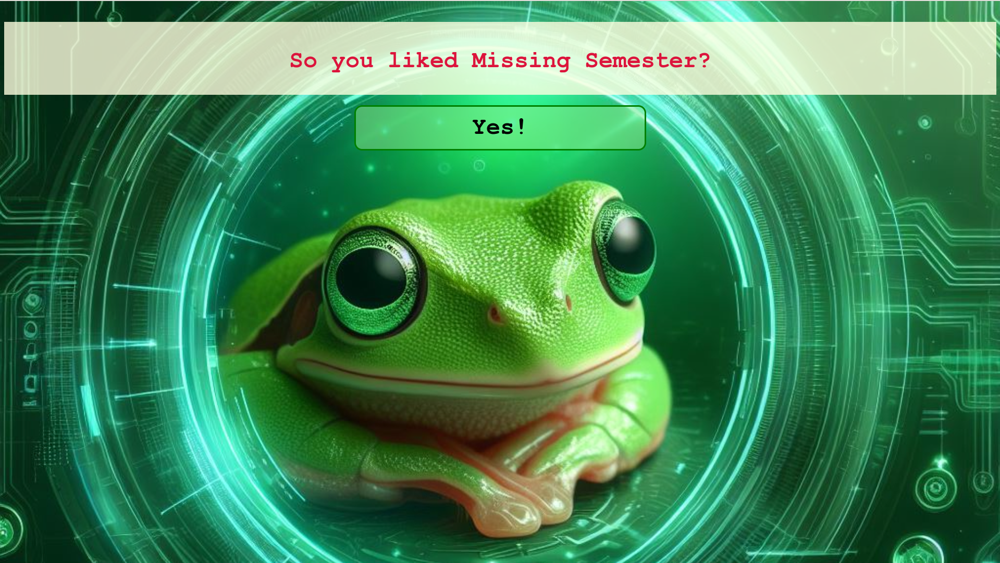
Well, there you go! Good decision and the frog is happy too! Well done!
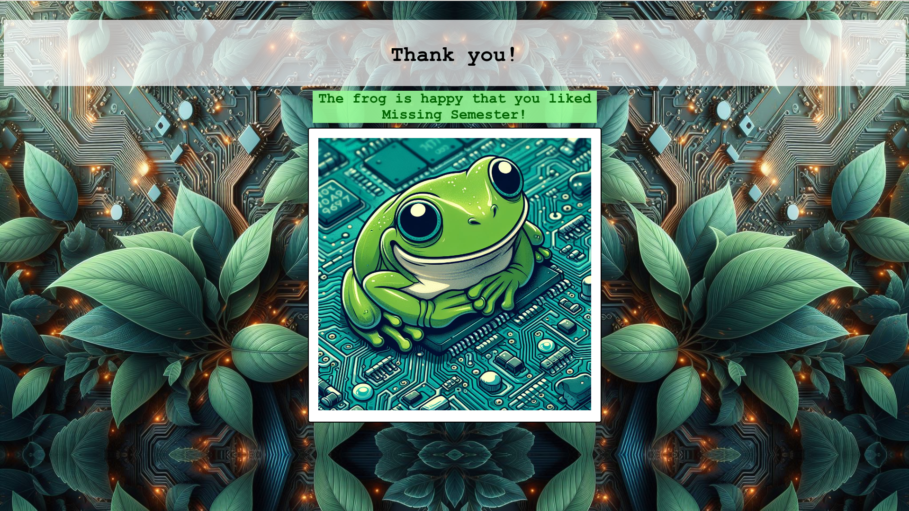

## Tooles we used
Not only did we learn about html, css and javascript, we also had fun creating the page and game.  
All images, except for the meme, were created with [Microsoft Bing Image Creator supported by DALL-E 3](https://www.bing.com/images/create).  
The meme was created with this [Meme Generator](https://imgflip.com/memegenerator).  
The Game is hosted at [itch.io](https://itch.io/).  
You can play it anytime without clicking through the pages at [v-oi-d: Evaluation Game](https://v-oi-d.itch.io/evaluation-game).
