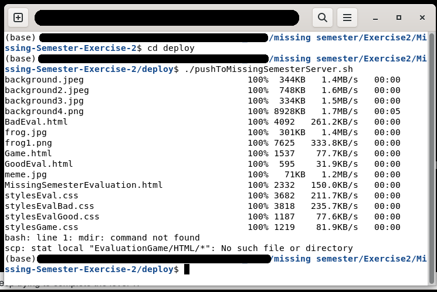

# Missing Semester Evaluation 
## Missing-Semester-Exercise-2 project from   Manuel Hochreiter and Andrea Zoitl

- [Introduction](#intro)
- [Are you curious?](#start)
- [What happens at this page?](#keepScrolling)
- [Tools we used](#tools)

## Introduction
At first we only thought about programming a Bad UI. But of course we also had to come up with a theme, otherwise it's only half as much fun. So why not evaluate the course?  
The result is a UI that is not bad at all, some of the buttons are perhaps a bit questionable visually, but it has actually become more of an entertainment than a bad UI. Have fun!

## Are you curious?
[Evaluations Game on Missing Machine](http://missing.sai.jku.at/~k00340477/Ex2/)   
or start with **MissingSemesterEvaluation.html**.  
**!!! Important:** We recommend unsing Google Chrome, as we sometimes had display errors with Firefox **!!!**

If you're not a fan of surprises and want to know what to expect, you'll have to scroll down. Otherwise the surprise would be spoiled for the others.

-
-
-
- keep scrolling
-
-
-
-
-
-
-
- keep scrolling
-
- 
-
-
-
-
- 
- keep scrolling
-
-
-
- 
-
-
-
- keep scrolling
-
-
-
-
-
- 
-
- keep scrolling
-
-
-
-
-
-
-
## So do you really want to see what happens before you try it out?
This is the starting page:

Try to press the button for the **good evaluation**. You will see that it keeps jumping away and therefore cannot be clicked.

Well, if the good evaluation button doesn't work, then try the **bad evaluation** button.  
**But**, a bad evaluation has to be earned:  Play the game, only then are you worthy.

Let's play the game! Press **Run game**.

Try to complete the level 1:  
Navigate with the arrow keys as usual. < for left, > for right and ^ for jumping. 

Keep trying to complete the level 1:

Oh, so you didn't manage level 1, maybe you can manage level 2?

Neither? Maybe level 3? 

Too bad, but a bad evaluation was a bad idea anyway.  

You're not giving up, all right, let's try again:

Seriously, a bad evaluation? 

Time to rethink your decision. Did you like Missing Semester?

Well, there you go! Good decision and the frog is happy too! Well done!

## Tooles we used
Not only did we learn about html, css and javascript, we also had fun creating the page and game.  
All images, except for the meme, were created with [Microsoft Bing Image Creator supported by DALL-E 3](https://www.bing.com/images/create).  
The game was made from scratch using the [Godot game engine](https://godotengine.org/) and assets by [Kenney](https://www.kenney.nl/).  
The meme was created with this [Meme Generator](https://imgflip.com/memegenerator).  
The Game is hosted at [itch.io](https://itch.io/).  
You can play it anytime without clicking through the pages at [v-oi-d: Evaluation Game](https://v-oi-d.itch.io/evaluation-game).  
We have written a shell script to upload the files to Missing Maschine. See folder deploy :-) Here's the proof that it worked:  
  
[back to top](#top)
